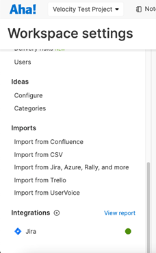
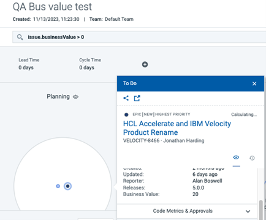

# Aha! - Usage

To use the Aha! plug-in, the plug-in must be loaded, and an instance created before you can configure the plug-in integration. You define configuration properties in the user interface.

## Prerequisites:

* Jira Integration (Refer: https://plugins.hcltechsw.com/jira/).
* VSM configuration for pulling Jira issues into Value Streams

## Integration type

The Aha! plug-in supports scheduled events integration which are listed in the following table.

| Name | Description | Synchronization Interval |
| --- | --- | --- |
| syncBusinessValue | Sync Business Value from Aha! | 5 minutes |

## Integration

The tables in the Configuration properties topic describe the properties used to define the integration.

* To install the plug-in, perform the following steps:

1. In Velocity, click **Settings** > **Integrations** > **Available**.
2. In the Action column for the Aha! plug-in, click **Install**.

* To integrate the plug-in, perform the following steps:

1. In Velocity, click **Settings** > **Integrations** > **Installed**.
2. In the Action column for the Aha! plug-in, click **Add Integration**.
3. On the Add Integration page enter values for the fields used to configure the integration and define communication.
4. Click **Add**.

## Configuration properties

In order to use Business Value features of Aha! there is configuration required in Aha! and DevOps Velocity (Velocity) product.

For configuring Aha!

* It requires that you setup a Jira integration in your AHA! Server. Here are the instructions provided by AHA! For their Jira integration: [AHA Jira Integration](https://www.aha.io/support/roadmaps/integrations/jira/jira-integration-version-2) and here is what you will see and where to configure

it in AHA : 

* After setting up an AHA! Jira integration, you can then refer back to the AHA! Documentation on how to link AHA! Items with Jira items: [AHA! Jira documentation](https://www.aha.io/support/roadmaps/integrations/jira/jira-integration-version-2)

* It should be noted that our AHA! Integration currently only supports “Features” from AHA!. Currently, Epics and Requirements are not imported into Velocity.
* After you have linking between AHA! Features and Jira issues, your features in AHA! will show that
Also notice the “Product Value” field (which is set to 10 in the picture). This is the data that the Velocity AHA! Integration will import. So, your Jira linked features in AHA! will need to be configured with product values (which is the entire point of the Velocity AHA! integration.)

linking: 
* The second prerequisite to configuring the Velocity AHA! Integration is that you will need a Velocity Jira integration that is pulling in the Jira issues to which your AHA features are linked (https://plugins.hcltechsw.com/jira/).
* This integration needs to be created before you setup your AHA! Integration. The AHA! Integration will use the imported Jira issues and add the “Product Value” coming from AHA! as a new field on our issues in Velocity called “Business Value”.
* After your Velocity Jira integration is setup and importing your issues that your AHA! Jira integration is linked to, you can now setup your Velocity AHA! integration. All you need for this is the URL of your AHA! server and an API token from AHA!

### Using Business Values information in VSM

Once the Aha! plug-in has been executed successfully; it is possible to observe business values from Aha! product into VSM. Perform the following steps to add the metrics in the value stream.

1. In Velocity, click **Value Streams**.
2. Click the required Value Stream.
3. Click the **Search with DQL**, then click enter DQL like issue.businessValue > 0
4. Notice all particles of work items which have business values associated with them in Aha! will show up.
* After the AHA! integration syncs, you will notice that your imported Jira issues in Velocity now have a new field called “Business Value”. If you setup a value stream with your Velocity Jira integration, the issues in AHA! that are linked to features will show business value on their dots:

* **Note**, that you can also run DQL on the new issue.businessValue field (as you can see above, we are running issue.businessValue > 0). This also allows you to setup value stream stages with queries involving business value.

### Configuration Properties

The following tables describe the properties used to configure the integration. Each table contains the field name when using the user interface and the property name.

* The General Configuration Properties table describes configuration properties used by all plug-in integrations.
* The Aha! plug-in Configuration Properties table describes the configuration properties that define the connection and communications with the Aha! product.

Some properties might not be displayed in the user interface, to see all properties enable the **Show Hidden Properties** field.

### General Configuration properties

| Name | Description | Required | Property Name |
| --- | --- | --- | --- |
| NA | The version of the plug-in that you want to use. To view available versions, click the Version History tab. If a value is not specified, the version named latest is used. | No | image |
| Integration Name | An assigned name to the value stream. | Yes | name |
| Logging Level | The level of Log4j messages to display in the log file. Valid values are: all, debug, info, warn, error, fatal, off, and trace. | No | loggingLevel |
| NA | List of plug-in configuration properties used to connect and communicate with the Aha! plug-in. Enclose the properties within braces. | Yes | properties |
|| The name of the tenant. | Yes | tenant_id |
| NA | Unique identifier assigned to the plug-in. The value for the Aha! plug-in is ucv-ext-aha. | Yes | type |
| Devops Velocity User Access Key |	An auto-generated user access key provides credentials for communicating with the Velocity server. | Yes | NA |

### Aha! Plug-in Properties

| Name | Type | Description | Required | Property Name |
| --- | --- | --- | --- | --- |
| Base URL for Aha! server | String | Base URL for Aha! server | Yes | baseUrl |
| Products | String | Comma separated list of products to sync (key or ID). Leave empty to sync all products | No | products |
| API Key | Secure | API Key to authenticate against Aha! | Yes | apiKey |
| Max Parallel Requests	Number | The maximum number of parallel requests to make to the Aha server. More requests may result in excessive network traffic and performance loss or instability. | No | requestParallelMax |
| Aha Request Batch Size | Number | The number of items to request at a time from the Aha server. An increased batch size may result in excessive network traffic and performance loss or instability. | No | requestAhaBatchSize |
| Request Retries | Number | Number of times to attempt each request to the Aha server (to help eliminate one-off request errors failing entire sync) | No | requestRetries |

|Back to ...||Latest Version|Aha! |||
| :---: | :---: | :---: | :---: | :---: | :---: |
|[All Plugins](../../index.md)|[Velocity Plugins](../README.md)|[1.0.1-File 1 ](https://raw.githubusercontent.com/UrbanCode/IBM-UCV-PLUGINS/main/files/ucv-ext-aha/ucv-ext-aha%3A1.0.1.tar.7z.001)[and 1.0.1-File 2](https://raw.githubusercontent.com/UrbanCode/IBM-UCV-PLUGINS/main/files/ucv-ext-aha/ucv-ext-aha%3A1.0.1.tar.7z.002)|[Readme](README.md)|[Overview](overview.md)|[Downloads](downloads.md)|
